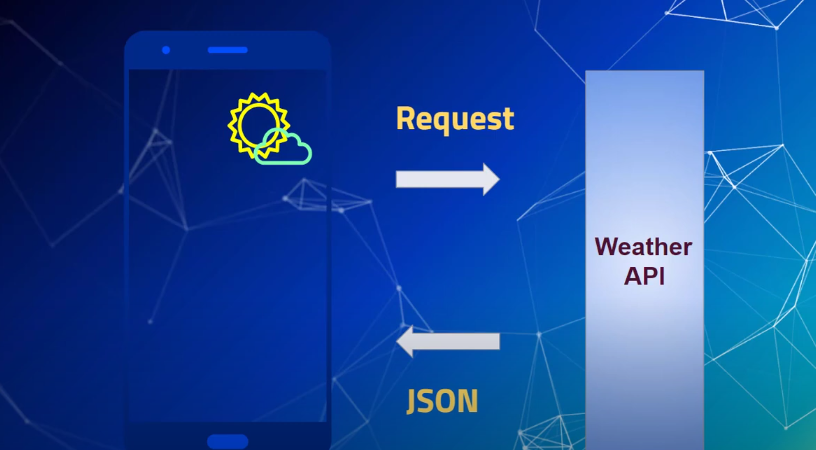
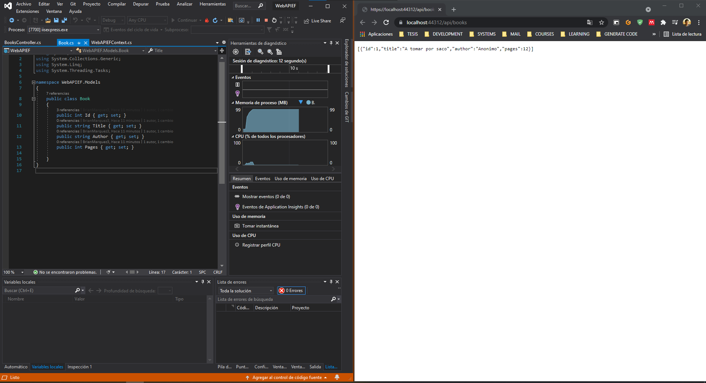
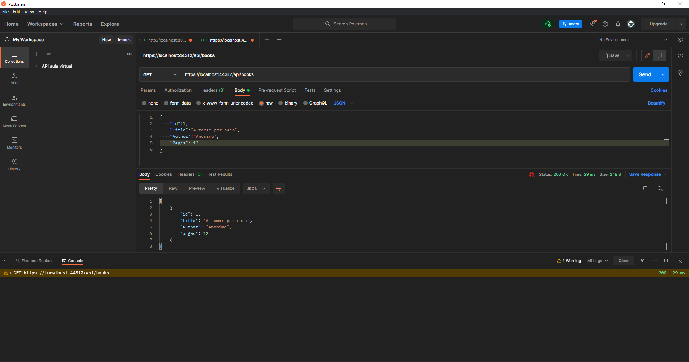
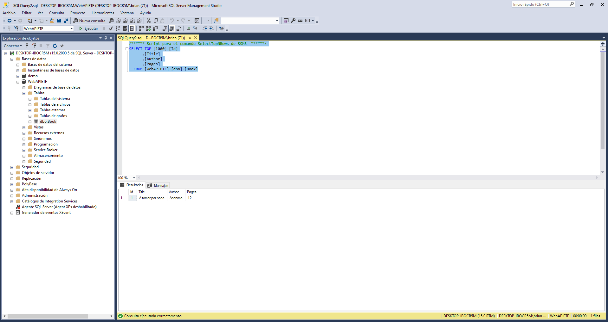
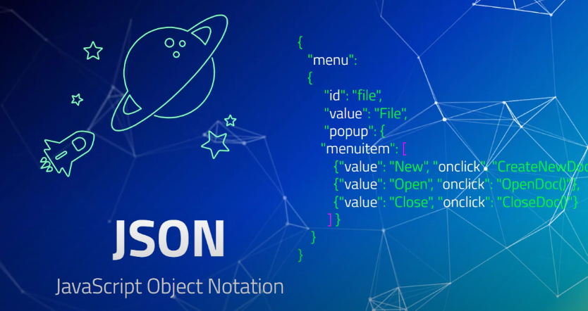

La interfaz de programación de aplicaciones, conocida también por la sigla API, en inglés, application programming interface, ​ es un conjunto de subrutinas, funciones y procedimientos que ofrece cierta biblioteca para ser utilizada por otro software como una capa de abstracción.

## API(aplication programing Interface)

- Interfaz que permite a distintas aplicaciones comunicarse entre si

<table align="center">
  <tr>
    <td align="center" style="padding=0;width=50%;">
      
    </td>
  </tr>
</table>

## Ejemplo del Clima

- Conexión a un API del clima

<table align="center">
  <tr>
    <td align="center" style="padding=0;width=50%;">
      
    </td>
  </tr>
</table>

## Ejemplo de API

-API de Instagram para las cantidad de seguidores por ejemplo

<table align="center">
  <tr>
    <td align="center" style="padding=0;width=50%;">
      
    </td>
  </tr>
</table>

## API Publica

[API Publicas](https://public-apis.io/)

<table align="center">
  <tr>
    <td align="center" style="padding=0;width=50%;">
      
    </td>
  </tr>
</table>

# Captura de imagenes de Ejemplo (.net Core)

<table align="center">
  <tr>
    <td align="center" style="padding=0;width=50%;">
      
    </td>
  </tr>
</table>

<table align="center">
  <tr>
    <td align="center" style="padding=0;width=50%;">
      
    </td>
  </tr>
</table>

<table align="center">
  <tr>
    <td align="center" style="padding=0;width=50%;">
      
    </td>
  </tr>
</table>

## JSON

- La Solicitud devuelve un archivo en formato JSON
- Estandar en la tranferencia de Datos
- Similar a XML

<table align="center">
  <tr>
    <td align="center" style="padding=0;width=50%;">
      
    </td>
  </tr>
</table>

## Creador

[The Coder Cave esp](https://www.youtube.com/watch?v=-BhQEntPrFE)